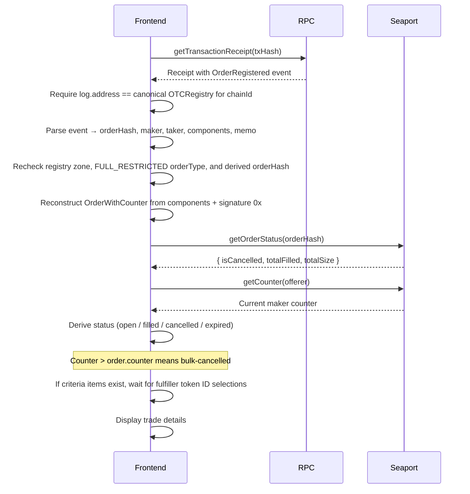
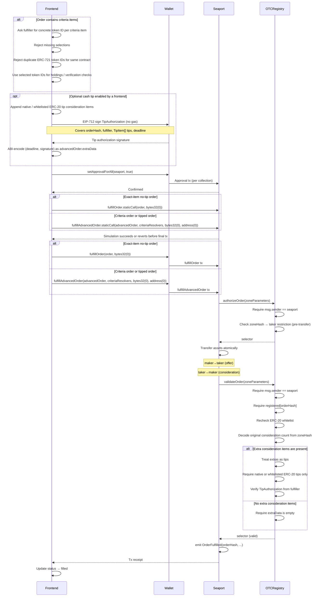
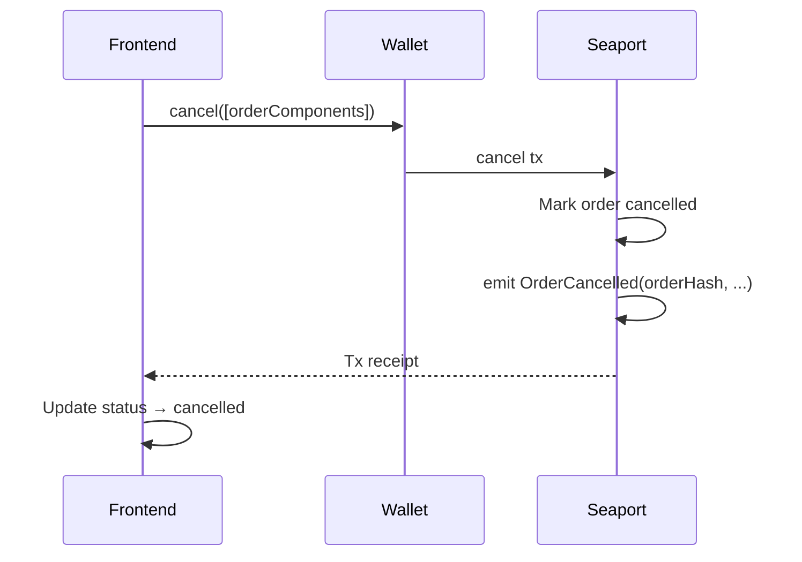
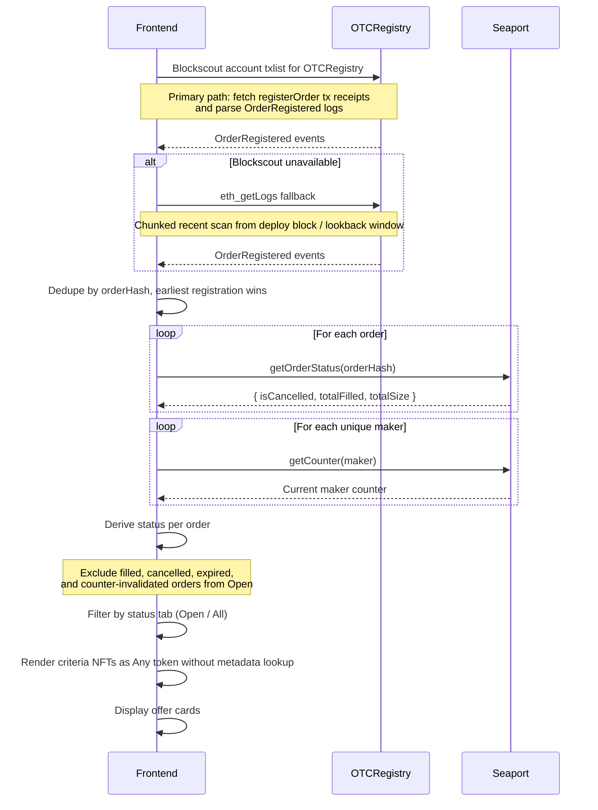

# ocarina.trade — System Interaction Flows

## Create Order

```mermaid
sequenceDiagram
    participant F as Frontend
    participant W as Wallet
    participant S as Seaport
    participant Z as OTCRegistry

    F->>F: Build order params from exact assets and optional Any Token criteria items
    Note over F: Any Token uses ERC721_WITH_CRITERIA / ERC1155_WITH_CRITERIA<br/>with identifierOrCriteria = 0 (wildcard)
    F->>F: Encode zoneHash: taker in low 160 bits,<br/>original consideration count + version in upper bits

    F->>W: setApprovalForAll(seaport, true)
    W->>S: Approval tx (per collection)
    S-->>F: Confirmed

    F->>F: Check offered exact assets are still held
    F->>F: Check Seaport approvals are visible onchain
    Note over F: Maker-side criteria items are approval-checked only;<br/>ownership depends on token ID chosen at fulfillment

    F->>W: EIP-712 sign Seaport order (no gas)
    W-->>F: Signed Seaport order { parameters, signature }

    F->>F: Compute orderHash (local, via seaport-js)

    F->>W: EIP-712 sign OTCRegistry registration (no gas)
    Note over F,W: domain: {name: "OTCRegistry", version: "1", chainId, zone}<br/>struct: {orderHash, seaportSignature, memo}
    W-->>F: Registration signature

    F->>W: registerOrder(reg)
    W->>Z: registerOrder tx (submitter can be maker or a relayer)
    Z->>Z: Check memo length ≤ 280
    Z->>Z: Check startTime <= block.timestamp <= endTime
    Z->>Z: Assert zone == address(this)
    Z->>Z: Assert orderType == FULL_RESTRICTED
    Z->>Z: Assert conduitKey == bytes32(0)
    Z->>Z: Require valid zoneHash metadata
    Note over Z: version == 1, reserved bits == 0,<br/>originalConsiderationCount == components.consideration.length
    Z->>S: getCounter(offerer)
    S-->>Z: Current maker counter
    Z->>Z: Require components.counter == current counter
    Z->>Z: Validate item shape, recipients, native side, ERC-20 whitelist, and ERC-165
    Note over Z: ERC-721 criteria items must have amount 1;<br/>multiple Any ERC-721s are separate criteria items
    Note over Z: ERC-165 validation also probes 0xffffffff<br/>to reject permissive responders
    Z->>Z: orderHash = ISeaport.getOrderHash(components) (delegates to Seaport)
    Z->>Z: Check !registered[orderHash]
    Note over Z: registered is both duplicate-publication guard<br/>and settlement allowlist
    Z->>Z: registered[orderHash] = true (CEI before signature check)
    Z->>Z: Verify registration signature (ECDSA or EIP-1271) against OTCRegistry domain
    Z->>S: validate([{ parameters, seaportSignature }])
    S-->>Z: true or revert
    Z->>Z: taker = address(uint160(zoneHash))
    Z->>Z: emit OrderRegistered(orderHash, maker, taker, components, memo)
    Z-->>F: Tx receipt

    F->>F: Navigate to /offer/{chainId}/{txHash}
```

## View Trade (Load from URL)



## Accept (Fill) Order



## Cancel Order



## Browse Offers


