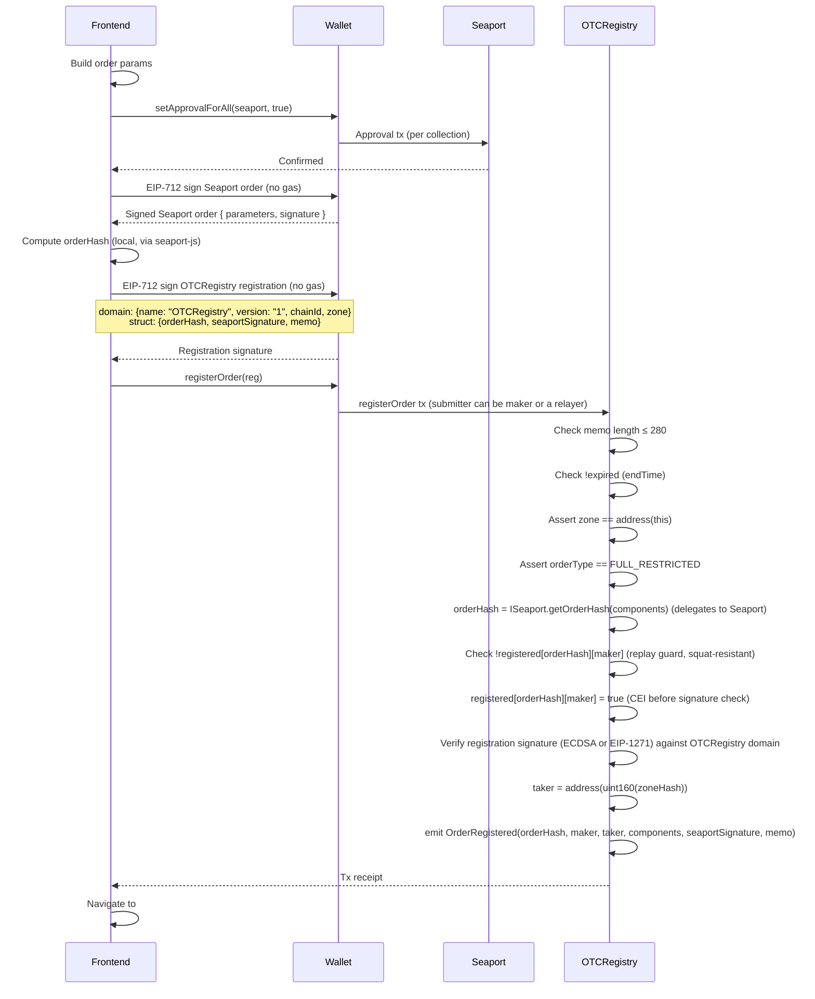
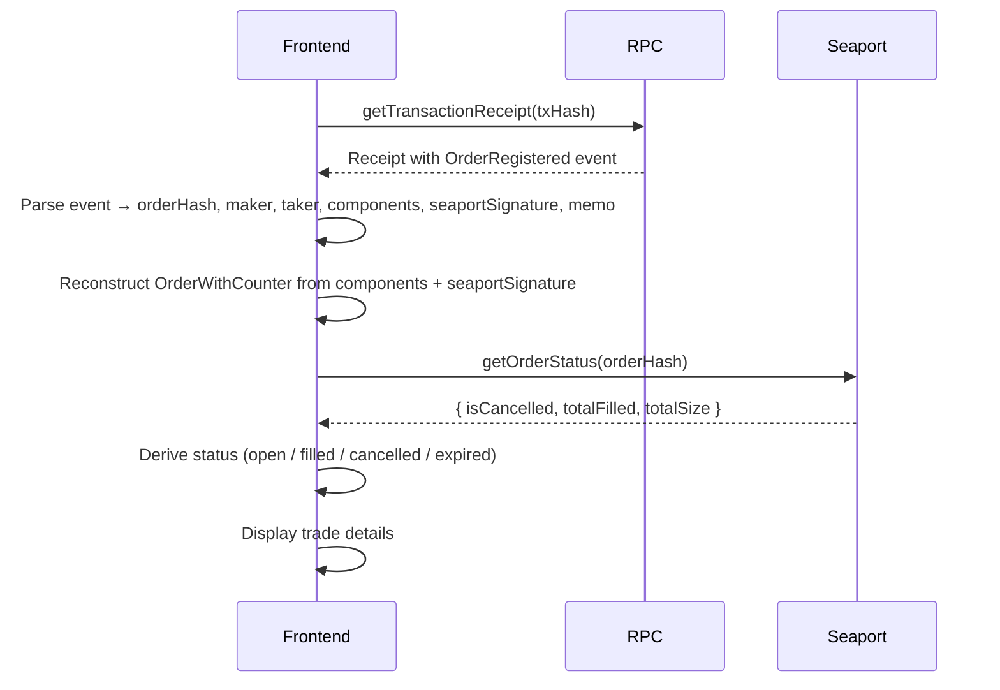
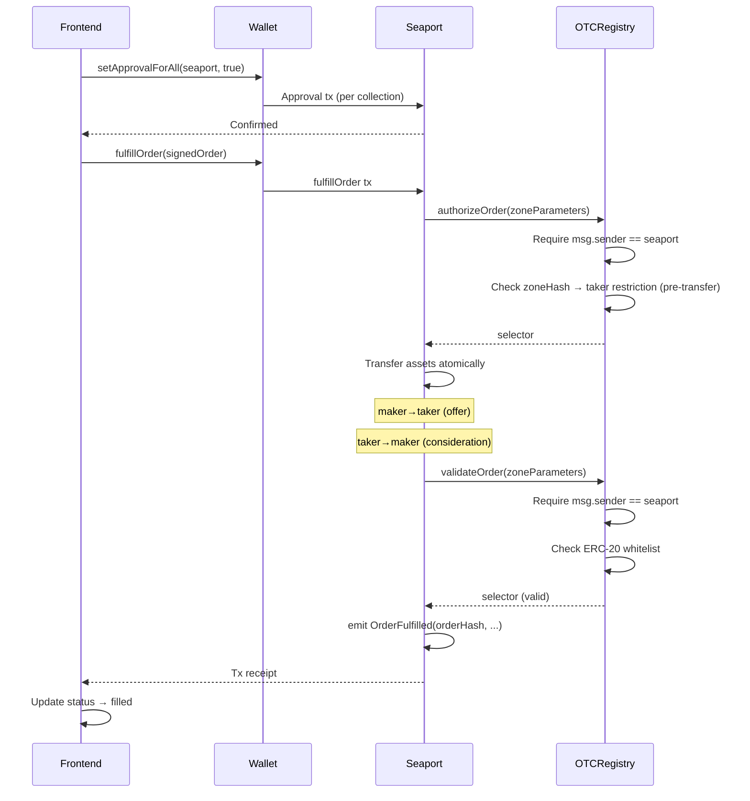
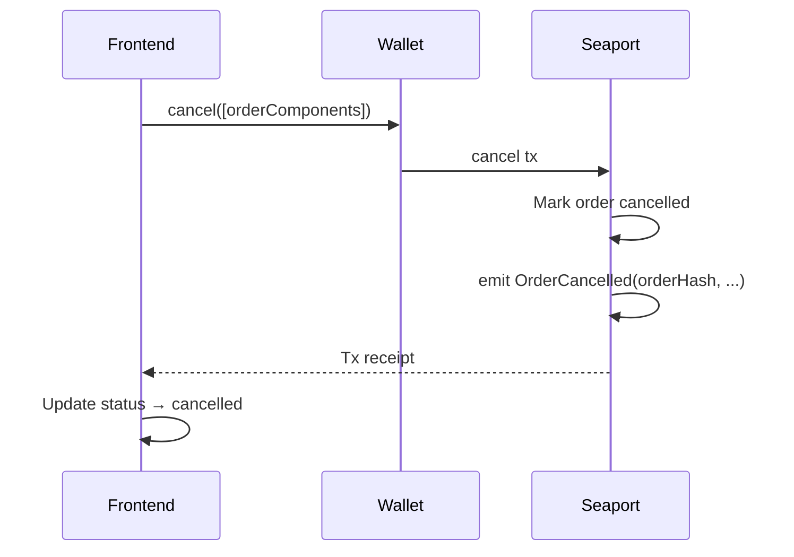
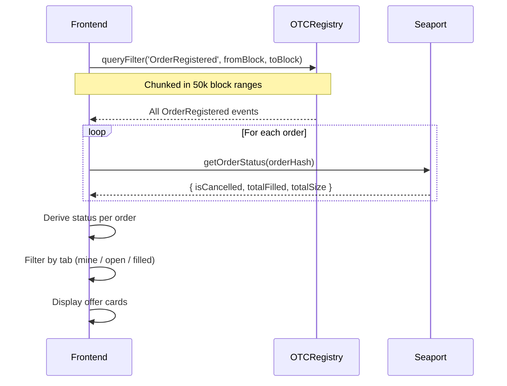

# ocarina.trade — System Interaction Flows

## Create Order

```mermaid
sequenceDiagram
    participant F as Frontend
    participant W as Wallet
    participant S as Seaport
    participant Z as OTCRegistry

    F->>F: Build order params

    F->>W: setApprovalForAll(seaport, true)
    W->>S: Approval tx (per collection)
    S-->>F: Confirmed

    F->>W: EIP-712 sign Seaport order (no gas)
    W-->>F: Signed Seaport order { parameters, signature }

    F->>F: Compute orderHash (local, via seaport-js)

    F->>W: EIP-712 sign OTCRegistry registration (no gas)
    Note over F,W: domain: {name: "OTCRegistry", version: "1", chainId, zone}<br/>struct: {orderHash, seaportSignature, memo}
    W-->>F: Registration signature

    F->>W: registerOrder(reg)
    W->>Z: registerOrder tx (submitter can be maker or a relayer)
    Z->>Z: Check memo length ≤ 280
    Z->>Z: Check !expired (endTime)
    Z->>Z: Assert zone == address(this)
    Z->>Z: Assert orderType == FULL_RESTRICTED
    Z->>Z: orderHash = ISeaport.getOrderHash(components) (delegates to Seaport)
    Z->>Z: Check !registered[orderHash][maker] (replay guard, squat-resistant)
    Z->>Z: registered[orderHash][maker] = true (CEI before signature check)
    Z->>Z: Verify registration signature (ECDSA or EIP-1271) against OTCRegistry domain
    Z->>Z: taker = address(uint160(zoneHash))
    Z->>Z: emit OrderRegistered(orderHash, maker, taker, components, seaportSignature, memo)
    Z-->>F: Tx receipt

    F->>F: Navigate to #/offer/{chainId}/{txHash}
```

## View Trade (Load from URL)

```mermaid
sequenceDiagram
    participant F as Frontend
    participant R as RPC
    participant S as Seaport

    F->>R: getTransactionReceipt(txHash)
    R-->>F: Receipt with OrderRegistered event

    F->>F: Parse event → orderHash, maker, taker, components, seaportSignature, memo
    F->>F: Reconstruct OrderWithCounter from components + seaportSignature

    F->>S: getOrderStatus(orderHash)
    S-->>F: { isCancelled, totalFilled, totalSize }

    F->>F: Derive status (open / filled / cancelled / expired)
    F->>F: Display trade details
```

## Accept (Fill) Order

```mermaid
sequenceDiagram
    participant F as Frontend
    participant W as Wallet
    participant S as Seaport
    participant Z as OTCRegistry

    F->>W: setApprovalForAll(seaport, true)
    W->>S: Approval tx (per collection)
    S-->>F: Confirmed

    F->>W: fulfillOrder(signedOrder)
    W->>S: fulfillOrder tx

    S->>Z: authorizeOrder(zoneParameters)
    Z->>Z: Require msg.sender == seaport
    Z->>Z: Check zoneHash → taker restriction (pre-transfer)
    Z-->>S: selector

    S->>S: Transfer assets atomically
    Note over S: maker→taker (offer)
    Note over S: taker→maker (consideration)

    S->>Z: validateOrder(zoneParameters)
    Z->>Z: Require msg.sender == seaport
    Z->>Z: Check ERC-20 whitelist
    Z-->>S: selector (valid)

    S->>S: emit OrderFulfilled(orderHash, ...)
    S-->>F: Tx receipt

    F->>F: Update status → filled
```

## Cancel Order

```mermaid
sequenceDiagram
    participant F as Frontend
    participant W as Wallet
    participant S as Seaport

    F->>W: cancel([orderComponents])
    W->>S: cancel tx

    S->>S: Mark order cancelled
    S->>S: emit OrderCancelled(orderHash, ...)
    S-->>F: Tx receipt

    F->>F: Update status → cancelled
```

## Browse Offers

```mermaid
sequenceDiagram
    participant F as Frontend
    participant Z as OTCRegistry
    participant S as Seaport

    F->>Z: queryFilter('OrderRegistered', fromBlock, toBlock)
    Note over F,Z: Chunked in 50k block ranges
    Z-->>F: All OrderRegistered events

    loop For each order
        F->>S: getOrderStatus(orderHash)
        S-->>F: { isCancelled, totalFilled, totalSize }
    end

    F->>F: Derive status per order
    F->>F: Filter by tab (mine / open / filled)
    F->>F: Display offer cards
```
